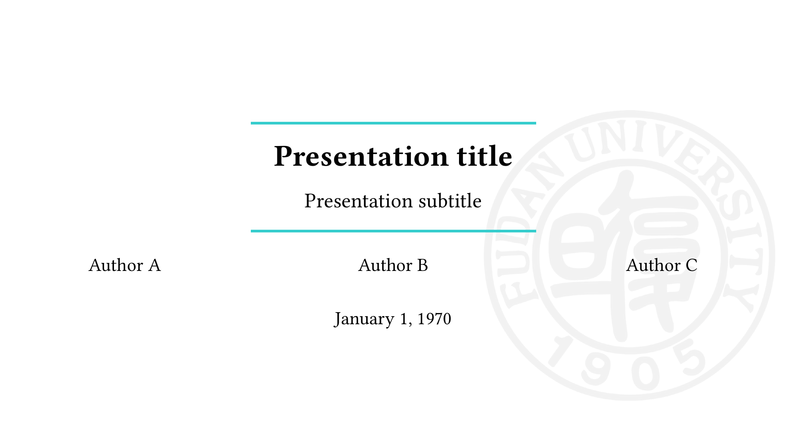

**Language**: \[English\] [\[简体中文\]](README.zh-CN.md)

# Fudan Theme for Typst Slides
This project is a [Typst](https://typst.app/) slide template based on the [Polylux](https://andreaskroepelin.github.io/polylux/book/polylux.html) library and its official theme [Clean](https://github.com/andreasKroepelin/polylux/blob/9184eeff02c5d03368b21024486ad2a2b8f65e0c/themes/clean.typ).

## Preview



## Usage
### 1. Install Typst or use Typst online
Typst can be used [online](https://typst.app/) or [downloaded and installed as a command line tool](https://github.com/typst/typst).

It is recommended to use Typst online for the first time to experience full features.

### 2. Import Polylux package
Unfortunately, the [package management](https://github.com/typst/packages) feature of Typst is still experimental, so there is no complete package management system like that in TeX.

If you use Typst online, you can import the Polylux package directly in the Typst editor:

```typst
// Please modify the 0.2.0 below according to the latest version number in the Polylux repository
#import "@preview/polylux:0.2.0": *
```

If you use the `typst` command line tool, you can skip this step because this repository already contains the Polylux package as a submodule.

### 3. Download and import the template
> **TODO**
>
> The instructions for online use have not been completed yet. Please follow the steps for local use temporarily.

If you use the `typst` command line tool, clone this repository:

```shell
# If you have installed Git:
git clone https://github.com/w568w/typst-slides-fudan.git --recursive
# Or, if you have installed GitHub CLI:
gh repo clone w568w/typst-slides-fudan && cd typst-slides-fudan && git submodule update --init --recursive
# Or, if you have configured Git over SSH:
git clone git@github.com:w568w/typst-slides-fudan.git --recursive
```

> **Note**
>
> Do NOT forget the `--recursive` option, otherwise the Polylux package will not be cloned.


Additionally, you can click the `Code` button on the repository page, and then click `Download ZIP` to download a compressed version of this repository, and unzip it to use.

It is strongly recommended that you start with `demo.typ`, which is a simple example that demonstrates all the features of this template.

> **Note**
>
> Since `demo.typ` references the libraries and themes in the `themes` directory, please do NOT move `demo.typ` to other directories, otherwise Typst will fail to compile.

## To-do list
Check the [Chinese version](README.zh-CN.md) for more details.

## License
All code and documents in this repository are released under the [GNU General Public License v3.0](LICENSE).